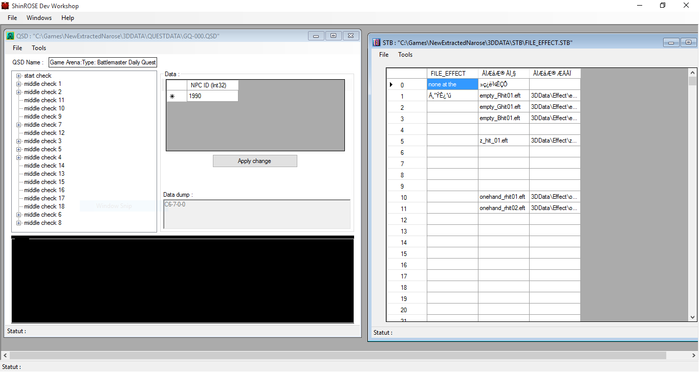

# ROSE-Dev-Workshop
I recently recovered many old projects of mine from hard-drive. This one might be the most precious to me.
It was my first try on a "big" programming project. At that time, around 2007 I would say, I was working on some ROSEs private servers.
I was annoyed by the lack of decents editors for the various content files, and decide to use my basic C# skills to create an editor for the following formats:

* AIP (AI logic)
* CHR (Character data)
* LTB (Quest dialogs)
* QSD (Quest logic)
* STB (String data table)
* STL (String language table)
* TSI (Icon list)
* VFS (Virtual file system)
* ZSC (Models list)

I was really proud of this editor! And it might have been my first step that lead me to do a computer scientist carrier.

I managed to get back the sources but it wouldn't most likely compile again in this current state!
You can use it for education purpose, though.

Jiwan
